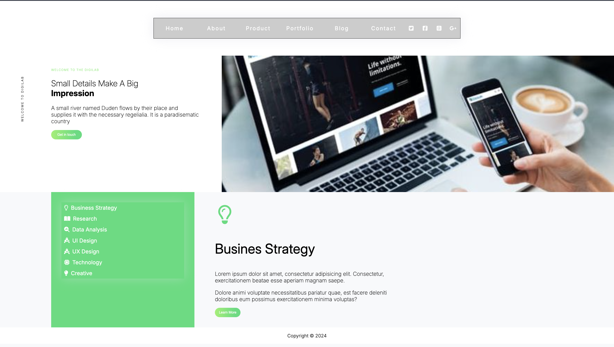

# 💡 Digilab Landing Page Clone

This project is a clone of a modern and minimalistic **landing page design**, recreated using **HTML** and **CSS** to demonstrate and improve my frontend development skills. The layout was inspired by a clean UI/UX example and enhanced with custom elements, including a navigation bar, responsive design, and sleek animations to give it a more professional and functional look.

## 📸 Preview



## 🚀 Features

- ✅ Responsive layout using **Flexbox**
- ✅ Custom **Navigation Bar**
- ✅ **Media Queries** for full mobile responsiveness
- ✅ Smooth **hover effects** and shadows
- ✅ Clean and modern **typography**
- ✅ Visual hierarchy using **icons** and color
- ✅ Structured layout with reusable **CSS classes**
- ✅ Extended customizations beyond original design

## 🧠 What I Learned

- Advanced use of **Flexbox** and layout techniques
- Writing **Media Queries** for multiple screen sizes
- Creating clean and responsive **UI components**
- Organizing a scalable project structure
- Enhancing UI/UX with animations and visual feedback
- Working with **custom icons** and images effectively

## 🌐 Technologies Used

- HTML5
- CSS3
- Google Fonts
- Font Awesome / Custom icons
- Media Queries
- Flexbox

## 📂 Project Structure

```bash
├── index.html
├── styles.css
├── flex001.html
├── flex001.css
├── working.jpg
├── Screenshot-2025-04-08-at-14.49.41.png
```
